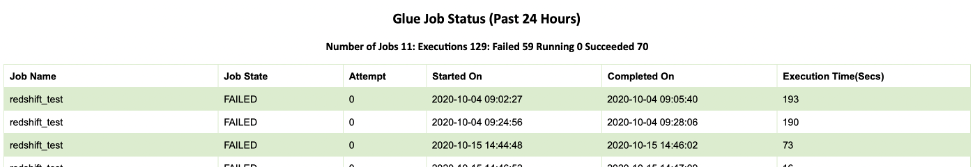

# Glue Job Status Reporting Email 


Usually there are the many jobs in an ETL environment and while Glue can send job status update through CloudWatch, there often a need to see an end-of-day consolidated report. The implementation is meet that requirement by producing a daily Glue Job Status report. This can be scheduled to run every day to run at a particular time to receive Glue job report. 

The report code and environment setup is done using lambda inline code through a CloudFormation template. The lambda contains necessary Python code to collect job status within a configured time period (24 hours ). The job status is created in an HTML report and sent via SES to validated email ID. SES is chosen as it supports HTML formatted table data. 

**How to run it**: 

**Through Console:** 

Download the attached CloudFormation Template and execute it. The code is added as inline code for the lambda function so no external resource is required. 


 

The lambda requires the following permissions. 

```
- glue:GetJob
- glue:GetJobs
- glue:GetJobRun
- glue:GetJobRuns
- glue:ListJobs
- ses:SendEmail
- AWSLambdaBasicExecutionRole
```


Template requires the following parameters. 

 

```
1. sesEmailAddress : email address or the comma separated email addresses. 
2. lookBackHours : The time period to define to discard job execution time.  A job run is discarded if it falls outside 24 hours execution time. Default 24 hours.
3. htmlTableFormat : In attempt to reduce Lambda code size to keep the code size within limits. This contains html table formatting. No change is required
4. tableHeader : In Attempt to reduce Lambda code size to keep the code size within limits. This contains html table cell structure. No change is required
```

**Thorough CLI**

 

Command Line Execution:
```
aws cloudformation deploy --stack-name glue-notification --template-file glue_email_notification.yaml --capabilities CAPABILITY_IAM --parameter-overrides lookBackHours=2244 fromEmail='myemail@amazon.com' toEmail="['toEmail1@amazon.com','toEmail2@amazon.com']
```


 

**Console Execution**

Upload the file from S3 or Local and Create a Stack. 

 

1. Allow end users to deploy:

   - Enter a validated SES email address in the fromEmail parameter

   - Enter a validated SES email address in the toEmail parameter

2. Click Next, Next and check the acknowledgement checkboxes in the blue Capabilities box at the bottom

3. Click Create. Then wait for the stack to complete and go to the lambda function created by the CloudFormation Stack. 

4.   Create a test event from ‘hello-lambda’ template and execute it. The lambda execution will send an email output. 

 

 

 

**Output report** 

 

 
